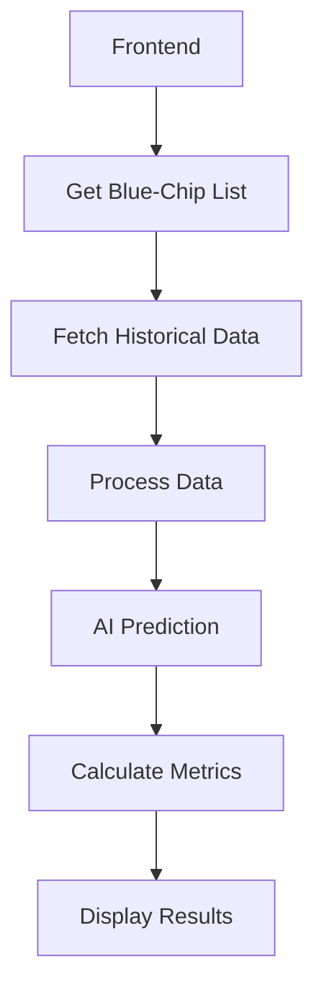

# Blue-Chip Scanner Analysis & Improvement Plan

## Current Implementation Analysis

### Architecture Overview

The blue-chip scanner operates through three main components:

1. **Frontend Component (BlueChipScanner.tsx)**
   - Handles user interface and interactions
   - Manages state for opportunities and loading
   - Provides filtering through minimum gain percentage
   - Displays results in a sortable table

2. **Backend Services (data.service.js)**
   - Fetches blue-chip stock list from Polygon.io
   - Retrieves historical data for analysis
   - Interfaces with multiple data providers
   - Handles API rate limiting and error fallbacks

3. **AI Service (model_service.py)**
   - Implements Linear Regression model
   - Uses 7-day window for predictions
   - Provides price predictions and confidence scores

### Current Data Flow



### Metrics Calculation

1. **Potential Gain**
   - Based on predicted vs current price
   - Minimum threshold configurable by user

2. **Confidence Score**
   - Derived from model prediction accuracy
   - Influenced by data quality and volatility

3. **Volatility**
   - Simple calculation based on price movements
   - Needs more sophisticated implementation

4. **Market Correlation**
   - Basic correlation with market index
   - Currently oversimplified

## Current Challenges

### 1. Data Management
- Rate limits across multiple API providers
- Data consistency issues
- Real-time data synchronization
- Historical data gaps

### 2. Model Limitations
- Simple Linear Regression insufficient
- Limited feature set
- No sentiment analysis
- Lack of fundamental analysis

### 3. Performance Issues
- Heavy API load
- Large data processing overhead
- Limited caching implementation
- Synchronous processing bottlenecks

### 4. Analysis Gaps
- Basic technical analysis
- Limited risk assessment
- No sector-specific insights
- Missing market context

## Improvement Plan

### Phase 1: Enhanced Data Pipeline

1. **Data Collection Improvements**
   ```python
   class EnhancedDataPipeline:
       def __init__(self):
           self.cache = RedisCache()
           self.validators = DataValidators()
           self.cleaners = DataCleaners()

       async def fetch_data(self, symbol):
           if self.cache.has(symbol):
               return self.cache.get(symbol)
           data = await self.fetch_from_apis(symbol)
           cleaned_data = self.process_data(data)
           self.cache.set(symbol, cleaned_data)
           return cleaned_data
   ```

2. **WebSocket Integration**
   ```typescript
   class RealTimeDataManager {
       private connections: Map<string, WebSocket>;
       
       constructor() {
           this.connections = new Map();
       }
       
       connect(symbol: string): void {
           const ws = new WebSocket(WEBSOCKET_URL);
           this.connections.set(symbol, ws);
           this.setupHandlers(ws, symbol);
       }
   }
   ```

### Phase 2: Advanced Model Implementation

1. **LSTM Model Enhancement**
   ```python
   class EnhancedPredictionModel:
       def __init__(self):
           self.lstm_model = self.build_lstm_model()
           self.sentiment_analyzer = SentimentAnalyzer()
           self.technical_indicators = TechnicalIndicators()

       def build_lstm_model(self):
           model = Sequential([
               LSTM(50, return_sequences=True),
               LSTM(50),
               Dense(1)
           ])
           return model
   ```

2. **Feature Engineering**
   ```python
   class FeatureEngineering:
       def __init__(self):
           self.technical = TechnicalIndicators()
           self.fundamental = FundamentalAnalysis()
           self.market = MarketAnalysis()

       def generate_features(self, data):
           technical_features = self.technical.calculate(data)
           fundamental_features = self.fundamental.analyze(data)
           market_features = self.market.analyze(data)
           return self.combine_features([
               technical_features,
               fundamental_features,
               market_features
           ])
   ```

### Phase 3: Risk Management

1. **Enhanced Volatility Calculation**
   ```python
   class RiskMetrics:
       def calculate_volatility(self, prices):
           returns = np.log(prices[1:] / prices[:-1])
           return np.std(returns) * np.sqrt(252)  # Annualized

       def calculate_var(self, returns, confidence=0.95):
           return np.percentile(returns, (1 - confidence) * 100)
   ```

2. **Position Sizing**
   ```python
   class PositionSizer:
       def calculate_position_size(self, capital, risk_per_trade, stop_loss):
           return (capital * risk_per_trade) / stop_loss

       def optimize_portfolio(self, positions, risk_tolerance):
           return self.apply_kelly_criterion(positions, risk_tolerance)
   ```

### Phase 4: Market Analysis

1. **Sector Analysis**
   ```python
   class SectorAnalysis:
       def analyze_sector_strength(self, sector_data):
           return {
               'trend': self.calculate_sector_trend(sector_data),
               'relative_strength': self.calculate_relative_strength(sector_data),
               'correlation': self.calculate_sector_correlation(sector_data)
           }
   ```

2. **Market Regime Detection**
   ```python
   class MarketRegimeDetector:
       def detect_regime(self, market_data):
           volatility = self.calculate_volatility(market_data)
           trend = self.calculate_trend(market_data)
           return self.classify_regime(volatility, trend)
   ```

## Implementation Timeline

1. **Week 1-2: Data Pipeline Enhancement**
   - Implement caching system
   - Add WebSocket connections
   - Improve data validation

2. **Week 3-4: Model Improvements**
   - Implement LSTM model
   - Add sentiment analysis
   - Enhance feature engineering

3. **Week 5-6: Risk Management**
   - Implement advanced volatility calculations
   - Add position sizing
   - Develop risk scoring system

4. **Week 7-8: Market Analysis**
   - Add sector analysis
   - Implement market regime detection
   - Integrate all components

## Success Metrics

1. **Prediction Accuracy**
   - Improve prediction accuracy by 30%
   - Reduce false positives by 50%

2. **Performance**
   - Reduce API calls by 60%
   - Improve response time by 40%

3. **Risk Management**
   - More accurate volatility measurement
   - Better position sizing recommendations

4. **User Experience**
   - Faster data loading
   - More actionable insights
   - Better visualization of opportunities

## Next Steps

1. Begin with the data pipeline improvements
2. Set up development environment for ML model enhancement
3. Create test suite for new features
4. Implement monitoring for new components